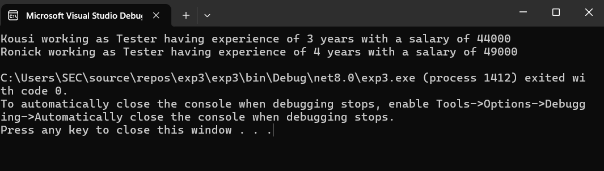

# Exp03-Constructor
## Aim: 
To write a C# program to calculate the salary of an employee by passing the name, designation, noofexperience, basic salary and insurance amount through constructor.

## Algorithm:
### Step1:
Initialize the program with the system library.

### Step2:
Define the Employee Class and set it as public.

### Step3:
Define the variables.

### Step4:
Write a parameterized constructor under the class Employee.

### Step5:
Define a function to calculate the salary.

### Step6:
Define the display() function to print the output


## Program:
```
using System;
namespace Constructor1
{
   public class Program
   {
        string name, designation;
        int bsalary, noofexp, insurance;
        float hra, ta, grosspay;
        public employee(string name, string designation, int bsalary, int noofexp, int insurance)
        {
            this.name = name;
            this.designation = designation;
            this.bsalary = bsalary;
            this.noofexp = noofexp;
            this.insurance = insurance;

        }
        public void salary()
        {
            hra = (20 / 100) * bsalary;
            ta = (10 / 100) * bsalary;
            grosspay = bsalary + hra + ta - insurance;
        }
        public void display()
        {
            Console.WriteLine("{0} working as {1} having experience of {2} years with a salary of {3}", this.name, this.designation, this.noofexp, this.grosspay);
        }
   }
   public class Exp3
   {
       static void Main(String[] args)
       {
            employee obj1 = new employee("Kousi", "Tester", 45000, 3, 1000);
            employee obj2 = new employee("Ronick", "Tester", 50000, 4, 1000);
            obj1.salary();
            obj2.salary();
            obj1.display();
            obj2.display();
       }
   }
}

```


## Output:


## Result:
Thus, a C# program is written to calculate the salary of an employee using a constructor is implemented and the output is verified.

